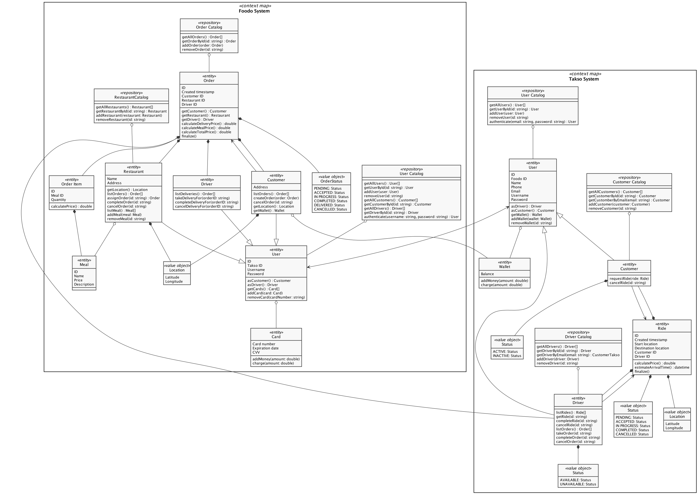

# Assignment 2

|   |   |
|---|---|
Course | Enterprise System Integration, MTAT.03.229, 2022
Group | M
Students | Sarp Aktuğ, Lukas Baltramaitis, Paulius Kuprevičius, Ihar Suvorau |
Source | [https://github.com/ut-esi-2022/assignment-2](https://github.com/ut-esi-2022/assignment-2)

## Task 1

### System 1: Takso Model

### System 2: Foodo Model

## Task 2. The Integrated Model

We present the integrated model using two diagrams:

1. With bounded contexts visible, which provides more information and makes services boundaries clear.
2. Without bounded contexts, which makes a diagram more compact and maybe a bit easier to read.

Regarding the integration, we have the following integration points according to our requirements from Assignment 1:

1. User — User. Takso's User has information about Foodo's User in order to satisfy requirements CF010 (see Appendix I), IF010, IF020, IF050.
2. Foodo' Customer — Takso's Wallet. So that a Foodo customer can pay for services using a Takso's wallet. Satisfies requirement IF030.
3. Takso's Driver — Foodo's Order. A Takso's driver can get or complete Foodo's orders, which satifies requirement IF040.

With bounded contexts:

Without bounded contexts:

Final attempt:

Final attempt with aggregates:

## Appendix I. Relevant Requirements From Assignment 1

CF010. As a user (driver, customer, restaurant, system operator), I want to be able to register in Takso or Foodo, also login and logout, so that I could use the service.

IF010. As a Foodo customer or driver, I want to be able to login into Takso without a separate registration, so my pain would be minimal.

IF020. As a Takso customer or driver, I want to be able to login into Foodo without a separate registration, so my pain would be minimal.

IF030. As a Foodo customer, I want to be able to pay for my order using the Takso wallet, so I could save time.

IF040. As a Takso driver, I want to get both orders from Foodo and rides from Takso services, so I could earn more money.

IF050. As a Foodo and Takso customer or driver, I want my accounts to be linked, so that I don’t need to manage two separate accounts.
