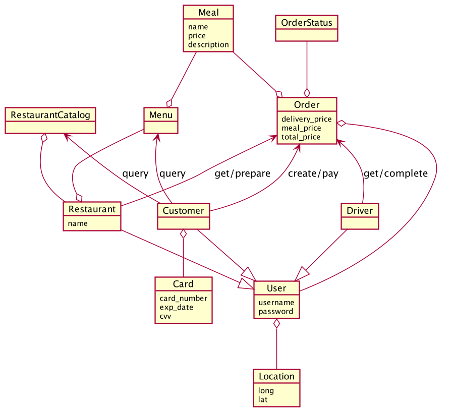

# Assignment 2

Assignment 2 description is available at https://courses.cs.ut.ee/MTAT.03.229/2022_spring/uploads/Main/Assignement_2.pdf.

## Task 1

### Takso Model

### Foodo Model

## Task 2. The Integrated Model

With bounded contexts:

Without bounded contexts:
